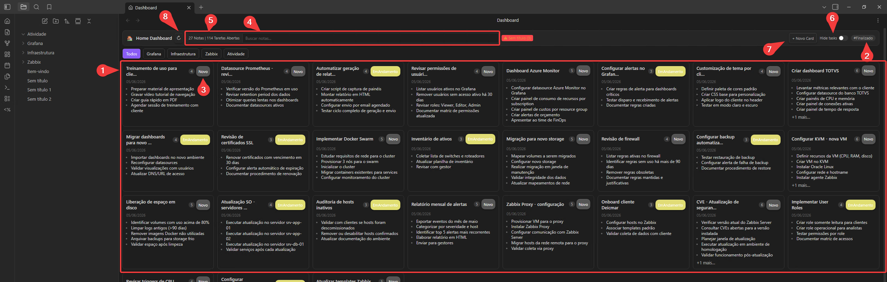
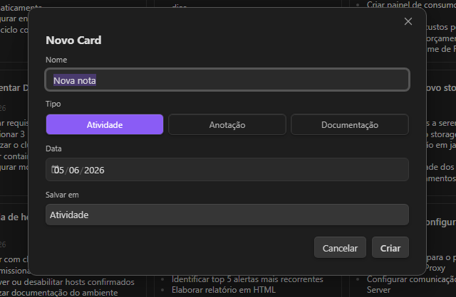
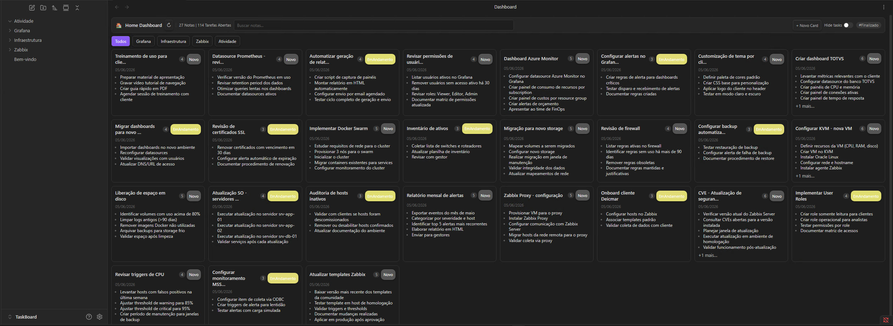

# TaskBoard — Obsidian Plugin

Dashboard visual de notas e tarefas por pasta. Visualize, filtre e gerencie suas atividades sem sair do Obsidian.

---

## Funcionalidades

- **1 Cards por pasta** — exibe notas como cards organizados por pasta raiz do vault
- **2 Filtro por status** — filtra por `#Novo`, `#EmAndamento` e `#Finalizado` via tags inline
- **3 Avanço de status** — botão no card cicla o status e salva direto no arquivo
- **4 Busca** — filtra cards por nome de arquivo com debounce de 250ms
- **5 Contador** — exibe total de notas e tarefas abertas no topo
- **6 Hide tasks** — toggle para ocultar/exibir a lista de checkboxes nos cards
- **7 Novo Card** — cria arquivos com templates prontos para Atividade, Anotação ou Documentação
- **8 Botão de refresh** — atualiza o dashboard sem sair da aba
- **9 Aviso de arquivos sem título** — detecta arquivos com "Sem título" no nome e exibe alerta
---



## Como funciona

### Tags de status

Adicione uma das tags abaixo em qualquer nota para que ela apareça no dashboard:

| Tag | Descrição |
|---|---|
| `#Novo` | Tarefa nova, ainda não iniciada |
| `#EmAndamento` | Tarefa em execução |
| `#Finalizado` | Tarefa concluída (oculta por padrão) |

> Notas sem nenhuma tag de status são tratadas automaticamente como `#Novo`.

### O que o plugin exibe

O plugin mostra notas que tenham **ao menos uma** das condições abaixo:

- Tag `#Task` no corpo do arquivo
- Pelo menos um checkbox aberto `- [ ]`

### Ciclo de status

Ao clicar no botão de status no card:

```
#Novo → #EmAndamento → #Finalizado → #Novo
```

O plugin substitui a tag diretamente no arquivo e aguarda o `metadataCache` atualizar antes de re-renderizar — sem necessidade de recarregar o vault.

---

## Templates — Novo Card

Ao criar um novo card pelo botão **+ Novo Card**, escolha o tipo:



**Atividade**
```markdown
#Novo #Task

Data:: YYYY-MM-DD

# Nome

## Tarefas

- [ ] 
```

**Anotação**
```markdown
#Novo

Data:: YYYY-MM-DD

# Nome

## Notas

```

**Documentação**
```markdown
#Novo

Data:: YYYY-MM-DD

# Nome

## Descrição

## Procedimento

## Referências
```

---

## Instalação manual

1. Faça o download ou clone este repositório
2. Copie a pasta para `.obsidian/plugins/taskboard/` dentro do seu vault
3. No Obsidian: **Configurações → Plugins da comunidade → Ativar plugins não seguros**
4. Ative o plugin **TaskBoard** na lista

### Build a partir do código fonte

```bash
npm install
npm run build
```

Os arquivos gerados (`main.js`, `manifest.json`, `styles.css`) devem ser colocados em `.obsidian/plugins/taskboard/`.

---

## Configuração

Para ignorar pastas específicas do dashboard, edite a linha abaixo em `main.ts`:

```typescript
private ignoreFolders = new Set(["Resources"]);
```

Adicione os nomes das pastas que não devem aparecer na barra de filtros.

---

## Estrutura do projeto

```
taskboard/
├── main.ts          # Código fonte principal
├── manifest.json    # Metadados do plugin
├── package.json     # Dependências e scripts
└── tsconfig.json    # Configuração TypeScript
```

---

## Requisitos

- Obsidian `0.15.0` ou superior
- Node.js `16+` para build

---

## Autor

**Egon Alves**  
[GitHub](https://github.com/egon-alves)

---

## Licença

MIT